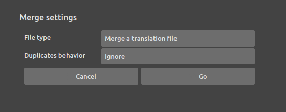

# Merge two translation files

If you need to merge different translation files, just click on the right part of the *open* button and select `Merge`.

You can merge another translation file or get strings from a source code.

When the incoming translation already exists, you can either ignore it or add it with a new context ("*imported*") used to differenciate it from the already existing one. This means the two strings will be considered different in the target application.
