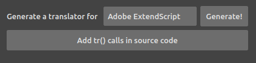

# Tools

From the tools, you can generate source files to be used in the target application to include *DuTF - The Duduf Translation Framework*.

You can then update the source code of the application to add the necessary `tr()` function calls provided by the framework to all the strings which have to be translated.
