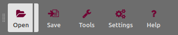
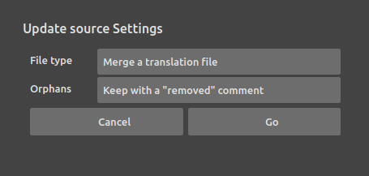
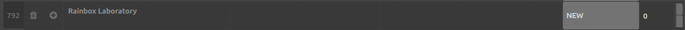

# Update translations

Software is never finished. Your applications are constantly evolving, and their interfaces are regularly adjusted. This means the translations have to be updated according to these changes.

DuTranslator provides an easy way to see what has changed and what needs to be updated.

## 1. Get the new translation template

You first need to get a new (empty or not) translation file from the updated version of the application.

The developper should provide this file, or you can generate it [as if you were starting a new translation](create.md).

The important thing is to get a file containing all the text strings used in the new version of the application, and it can work with an existing translation file used for another language.

## 2. Update the current translation with the new template

Click on the right part of the *open* button and select `Update`.

Choose the file type you're importing: it is either another (template) translation file or the source code of the application.

When updating, *DuTranslator* will ignore already existing text strings, add the new ones, and you have to choose what will be done with the text strings which have been removed from the application, which are called *orphans*. You can either automatically remove them, or keep them in the translation file, in which case *DuTranslator* will modify the associated comment to let you know which strings have been removed in the new version of the application.

New strings are appended to the table, and `NEW` is added to the comment (and the cell is highlighted) to help you easily see them.

You can now safely update the translations and save the file.
