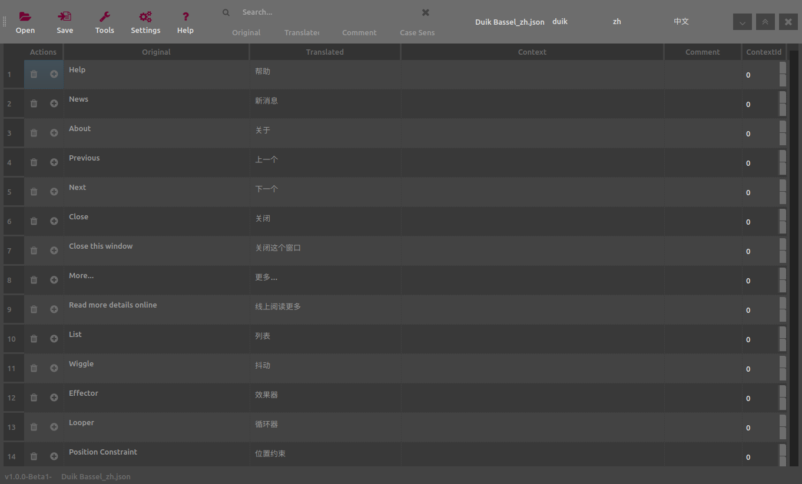

# How to use DuTranslator

- With the first column, you can add or remove translations. If a translation is removed from the file but is still used in the translated application, this specific string will be shown in the original language (i.e. you can remove proper nouns from the translation file and any string which does not have to be translated).

- The column labeled `Original` shows the string as it is used in the original language of the application. Do not change these unless you know they have also changed in the application source code.

- The column labeled `Translated` contains the translation of each string.

- The columns labeled `Context` and `Context Id` are used by the application to differenciate two (or more) different strings which meanings change depending on the context they are used in (i.e. for which the translation may be different depending on the context). Do not change these unless you know they have been changed in the source code too.

- You can use the column labeled `Comment` as you wish. The comments will be saved in the file, and can be used to save any information you may need, or questions for the developper of the application, etc.

A search bar is available at the top of *DuTranslator* to help you find any word or sentence in the translation file, being either in the original, translated or comment strings.

!!! Note
    You can change the language used by *DuTranslator* itself in the settings. For now, it is available in English, Français and 中文.
